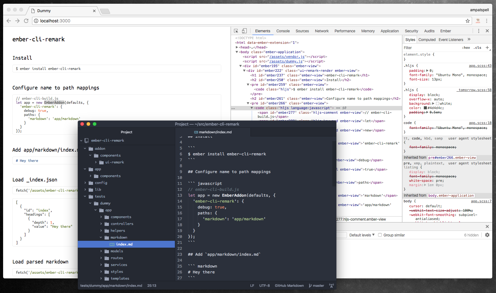

# ember-cli-remark-static

This addon let's you have one or more folders with markdown files which are transformed to abstact syntax tree by [remark](https://remark.js.org/) and made available as a json files.

Also it has component to render those json objects.

[Demo and documentation is here](https://ember-cli-remark-static.firebaseapp.com/).

